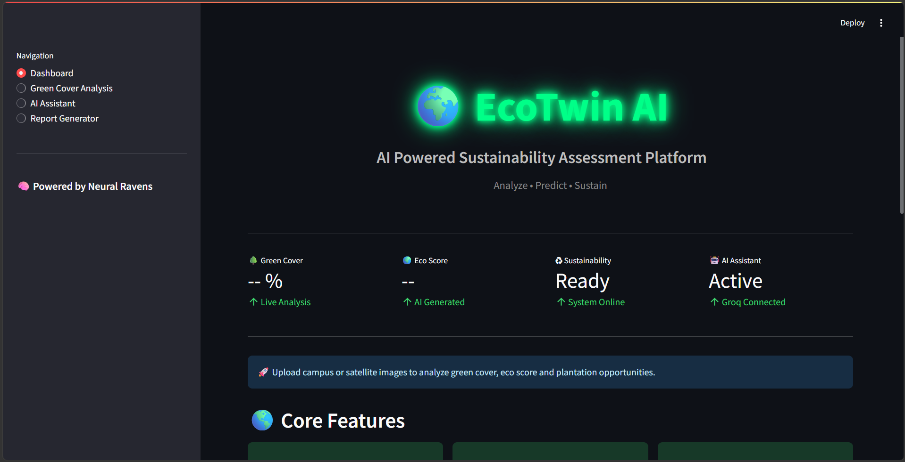
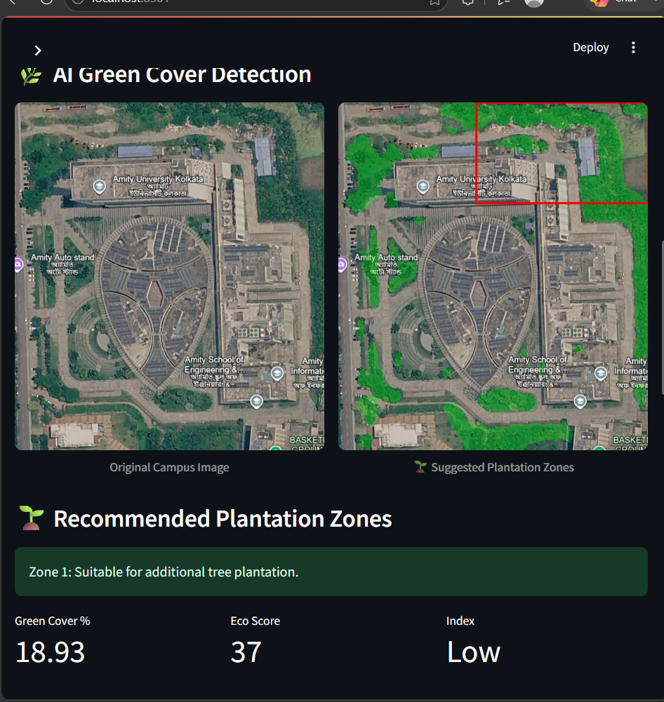
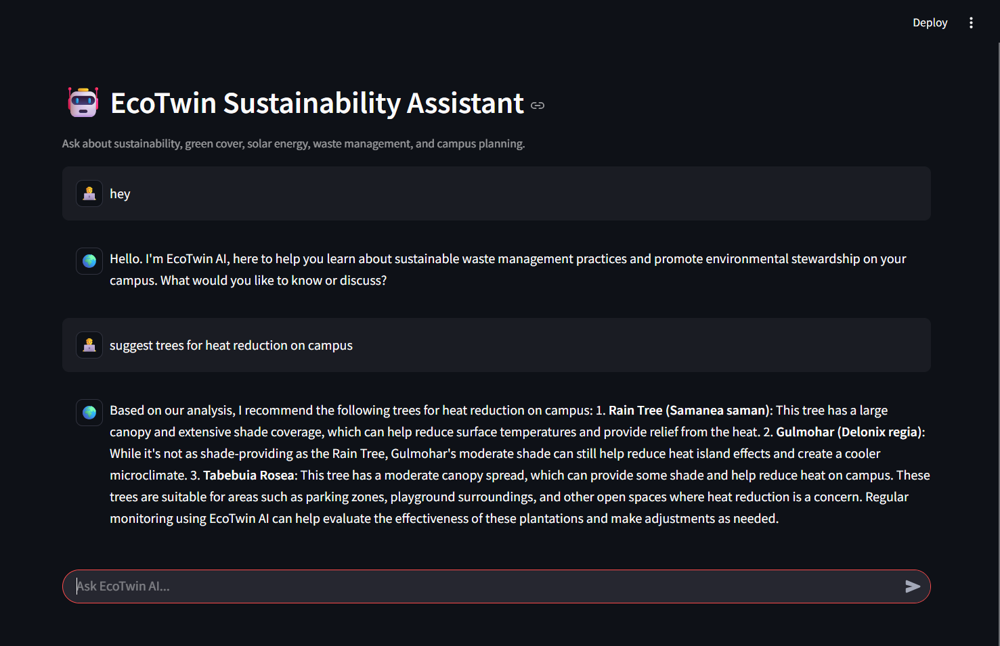
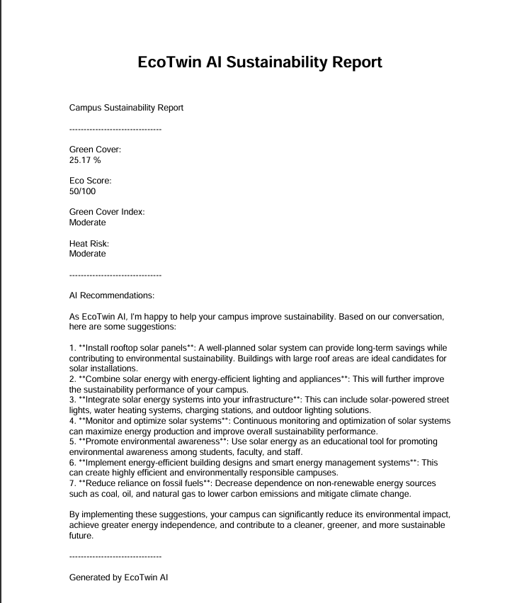
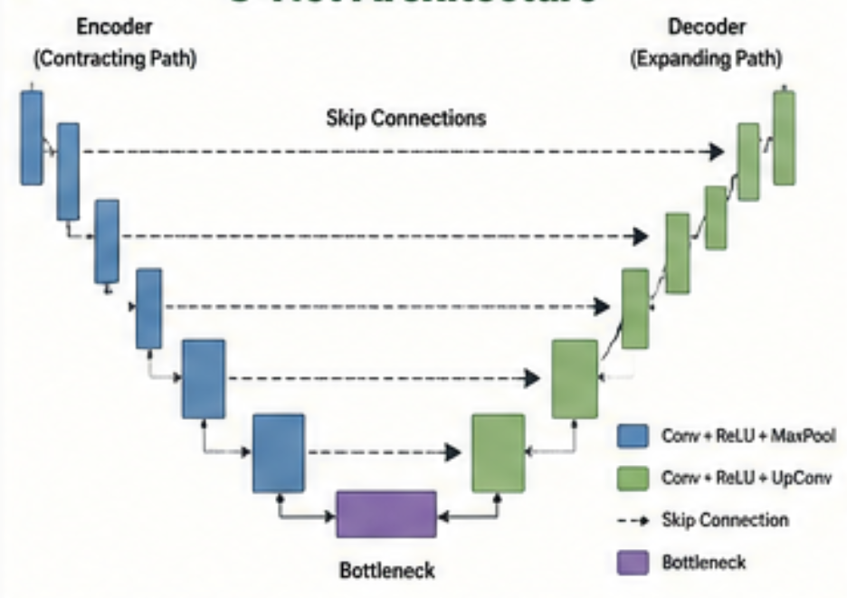

# 🌍 EcoTwin AI

> AI-Powered Sustainability Assessment Platform for Green Cover Analysis using U-Net Deep Learning and Satellite Imagery.


---

# 📖 Overview

EcoTwin AI is an AI-powered sustainability assessment platform designed to analyze vegetation coverage from satellite or aerial images. The system uses a U-Net semantic segmentation model to detect green areas, calculate green cover percentage, generate an Eco Score, recommend plantation zones, and provide AI-assisted sustainability insights.

The platform supports both image upload and latitude-longitude based satellite image analysis using Esri ArcGIS World Imagery.

---

# 🚀 Features

- 🌳 Green Cover Detection using U-Net
- 🛰 Satellite Image Analysis using Latitude & Longitude
- 📊 Green Cover Percentage Calculation
- 🌍 Eco Score Generation
- 🌱 Plantation Zone Detection
- 🤖 AI Sustainability Assistant
- 📄 Automated PDF Sustainability Report
- 📈 Interactive Dashboard
- 📍 Esri ArcGIS Satellite Imagery Integration

---

# 🏗 System Architecture

```
User Input
(Image / Latitude-Longitude)
            │
            ▼
Satellite Image (Esri API)
            │
            ▼
Image Preprocessing
            │
            ▼
U-Net Segmentation Model
            │
            ▼
Vegetation Mask
            │
            ▼
Green Cover Percentage
            │
            ▼
Eco Score
            │
            ▼
Plantation Zone Detection
            │
            ▼
Dashboard & PDF Report
```

---

# 🧠 Methodology

1. Upload an image or enter latitude & longitude.
2. Retrieve satellite imagery using Esri ArcGIS API.
3. Perform image preprocessing.
4. Segment vegetation using the trained U-Net model.
5. Generate a vegetation mask.
6. Calculate green cover percentage.
7. Compute Eco Score.
8. Detect suitable plantation zones using OpenCV.
9. Display results on the dashboard.
10. Generate a sustainability PDF report.

---

# 🤖 AI Model

### Model

- U-Net Semantic Segmentation
- ResNet34 Encoder
- PyTorch

### Input

- RGB Image (640 × 640)

### Output

- Binary Vegetation Mask

---

# 📊 Eco Score Formula

```
Eco Score = min(100, Green Cover × 2)
```

Green Cover Percentage is calculated from the vegetation mask generated by the U-Net model.

---

# 🛠 Tech Stack

| Layer | Technology |
|--------|------------|
| Frontend | Streamlit |
| Backend | Python |
| Deep Learning | PyTorch, U-Net |
| Computer Vision | OpenCV, Pillow |
| Satellite Imagery | Esri ArcGIS World Imagery |
| AI Assistant | Groq API |
| NLP | Sentence Transformers |
| Report Generation | ReportLab |
| Development | VS Code, Jupyter Notebook |

---

# 📂 Project Structure

```
EcoTwin-AI/
│
├── app.py
├── predict.py
├── requirements.txt
├── README.md
│
├── model/
│   └── unet_model.pth
│
├── docs/
│   ├── trees.txt
│   ├── solar.txt
│   ├── waste.txt
│   └── green_cover.txt
│
├── screenshots/
│
└── assets/
```

---
# 📸 Screenshots

## 🏠 Dashboard

<p align="center">
  
</p>

---

## 🌳 Green Cover Analysis

<p align="center">
  
</p>

---

## 🤖 AI Assistant

<p align="center">
  
</p>

---

## 📄 PDF Report

<p align="center">
  
</p>

---

## 🧠 U-Net Architecture

<p align="center">
  
</p>


# ⚙ Installation

Clone the repository

```bash
git clone https://github.com/yourusername/EcoTwin-AI.git
```

Move into the project

```bash
cd EcoTwin-AI
```

Install dependencies

```bash
pip install -r requirements.txt
```

Run the application

```bash
streamlit run app.py
```

---

# 📌 Future Scope

- Google Earth Engine Integration
- Drone-based Image Analysis
- Mobile Application
- Carbon Sequestration Prediction
- GIS Mapping
- Multi-Class Vegetation Segmentation

---

# 👨‍💻 Developed By

**Debasish Dey**

B.Tech Artificial Intelligence & Machine Learning

Techno International New Town

---

# 📄 License

This project is licensed under the MIT License.
